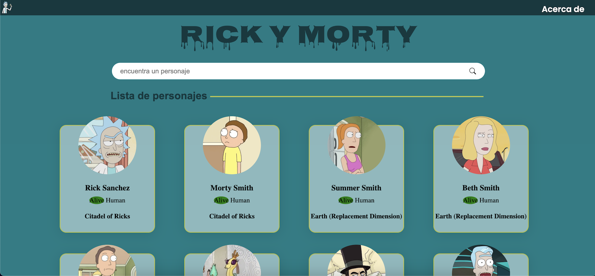
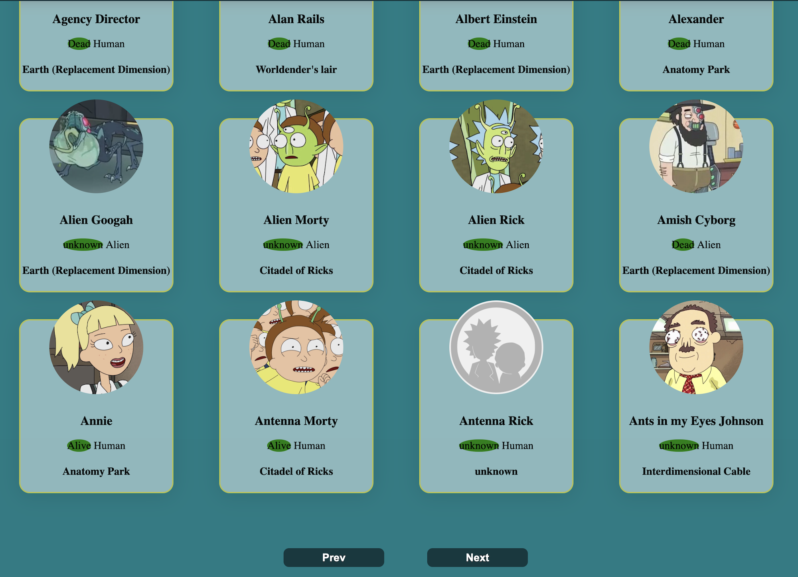

# Project Rick and Morty
Rick and morty api call of characters in the series built using react + vite.
Character name, location and status implemented, ease search of character by name and also possible
page toggle.

# Motive
A UI friendly app developed to aid rick and morty series fanatics to easily browse and know more about their favorite characters 
as well as a general info about the series.

# Build Status
Build complete, ready for shipping to production after testing.

# Code style
React component based method, folderize naming conventions and camelCase system of naming.
 Componization of code, DRY principle and sass styling( scss).

 # Screenshots 
 
 

 # Framework used/stacks
    * React + Vite
    * Javascript
    * Fetch API
    * Sass (scss)
    *HTML

# Installation
Open project in your IDE
npm install, to install dependencies or clone project on github
npm run dev
deploy project to production environment by toggling the link.

