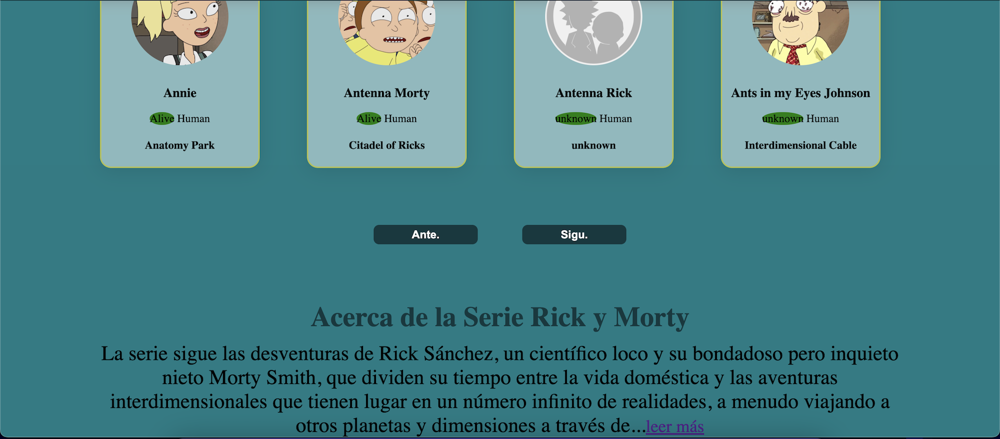

# Proyecto Rick y Morty
Llamada API de Rick y Morty a los personajes de la serie creada con React + Vite.
Nombre del personaje, ubicación y estado implementados, facilita la búsqueda del personaje por nombre y también es posible
alternar página.

# Motivo
Una aplicación compatible con la interfaz de usuario desarrollada para ayudar a los fanáticos de las series de Rick y Morty a navegar fácilmente y saber más sobre sus personajes favoritos.
así como información general sobre la serie.

# Estado
Construido completo, listo para su envío a producción después de las pruebas.

# Estilo de código
Método basado en componentes de React, convenciones de nomenclatura en carpetas y sistema de nomenclatura camelCase.
Componización de código, principio DRY y estilo sass (scss).
Mobile responsive para adaptar a dispositivos mobile y ipad.

# Capturas de pantalla 
 
 
 

# Framework usado/stacks
    * React + Vite
    * Javascript
    * Fetch API
    * Sass (scss)
    * HTML

# Instalación
Abra el proyecto en su IDE
npm install, para instalar dependencias o clonar proyecto en github
npm run dev en su terminal 
para ejecutar y abre el link.
click el link para abrir el interface en su browser.

